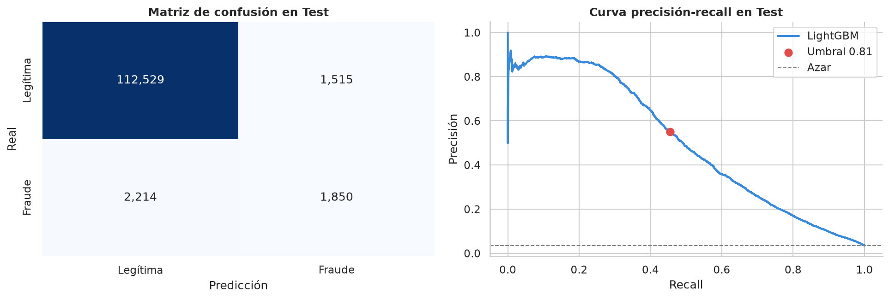

# Detección de fraude transaccional con SQL, Python y modelado

Proyecto integrador sobre las 590,540 transacciones de comercio electrónico del dataset **IEEE-CIS Fraud Detection** (Vesta Corporation). SQLite es la fuente única de datos y hace el trabajo pesado: uniones, tasas de nulos, cortes temporales y variables de comportamiento por tarjeta construidas con funciones de ventana. Python se encarga del análisis exploratorio, el pipeline de preprocesamiento, un modelo supervisado (LightGBM optimizado con Optuna y explicado con SHAP) y un detector no supervisado (autoencoder en PyTorch).

El enfoque es el de un sistema de monitoreo transaccional: las decisiones se toman con validación cronológica, el desempeño se mide con PR-AUC por el desbalance de clases (3.5% de fraude) y el resultado se traduce en cuántos fraudes captura un equipo de revisión con un presupuesto de alertas.

<p align="center">
  
</p>

## Hallazgos principales

| Pregunta | Resultado |
|---|---|
| ¿Alguna variable aislada delata el fraude? | No. La velocidad por card1, el z-score del monto y las variables C tienen poco poder por sí solas (correlación máxima de 0.037 con el fraude) |
| ¿Qué tan bien detecta el fraude el modelo? | En prueba (los últimos 41 días), LightGBM alcanza un **PR-AUC de 0.5029** (14.6 veces el de un modelo al azar) y un ROC-AUC de 0.9085 |
| ¿Qué significa en operación? | Revisando el 1% de las transacciones con mayor puntaje, el **85.4% de las alertas son fraude**; revisando el 5% se captura el 57.5% del fraude |
| ¿Importa la validación cronológica? | Sí. Reentrenar con los 40 días más recientes antes de la prueba sube el PR-AUC de 0.4503 a 0.5029: en fraude la recencia de los datos pesa tanto como el algoritmo |
| ¿Aportan las variables construidas en SQL? | Con las familias C, D y V de Vesta no (−0.0073 de PR-AUC), porque contienen la misma información de historial; sin ellas sí (+0.0226 de ROC-AUC) |
| ¿Sirve un autoencoder sin etiquetas? | Como complemento. Su PR-AUC es de 0.0667 y su 1% más anómalo son transacciones legítimas de alto volumen, pero con un presupuesto del 5% encuentra 182 fraudes que LightGBM no prioriza |

## Flujo de trabajo

| Notebook | Pregunta que responde | Contenido |
|---|---|---|
| [`00_crear_base_sqlite`](notebooks/00_crear_base_sqlite.ipynb) | ¿Cómo se organizan los datos? | Conversión de los CSV a SQLite por lotes e índices para uniones y filtros por tiempo |
| [`01_sql_exploracion`](notebooks/01_sql_exploracion.ipynb) | ¿Qué tan raro es el fraude y qué lo delata? | Balance de clases, velocidad transaccional, z-score del monto, aproximación de la tarjeta individual y variables de comportamiento con funciones de ventana |
| [`02_eda_python`](notebooks/02_eda_python.ipynb) | ¿Qué entra al pipeline? | Nulos calculados en SQL, temporalidad relativa, montos, variables C y comportamiento de las variables SQL |
| [`03_modelo`](notebooks/03_modelo.ipynb) | ¿Qué tan bien se puede detectar? | Partición 60/20/20 cronológica, pipeline, comparación de cuatro modelos, Optuna sobre validación, reentrenamiento, aporte de las variables SQL, umbral, presupuesto de alertas y SHAP |
| [`04_autoencoder_pytorch`](notebooks/04_autoencoder_pytorch.ipynb) | ¿Se puede detectar sin etiquetas? | Autoencoder entrenado con legítimas, error de reconstrucción por clase, comparación con LightGBM y solapamiento de alertas |

Las funciones que comparten los notebooks están en el paquete `fraude`, de modo que la conexión, las consultas, el pipeline y los modelos se definen en un solo lugar:

| Módulo | Contenido |
|---|---|
| `config.py` | Rutas relativas al repositorio, nombres de tablas, proporciones de la partición y semilla |
| `base_datos.py` | Creación de la base desde los CSV, índices, conexión, consultas y lectura por lotes con poca memoria |
| `datos.py` | Variables SQL, tasas de nulos y cortes temporales calculados en SQLite, carga del dataset de modelado y partición cronológica |
| `sql/features_tarjeta.sql` | Variables de comportamiento por tarjeta con funciones de ventana que solo miran transacciones anteriores |
| `pipeline.py` | Transformadores personalizados (temporales, log, exclusión de nulos, imputación por familia) y pipeline completo |
| `modelo.py` | Modelos base, métricas, optimización con Optuna, umbral, presupuesto de alertas y guardado |
| `autoencoder.py` | Autoencoder en PyTorch, escalado, entrenamiento y error de reconstrucción |
| `graficos.py` | Estilo y colores de las gráficas |

## Estructura del repositorio

```
├── data/                          # CSV del IEEE-CIS y base SQLite (no se versionan)
├── notebooks/                     # Cinco notebooks, uno por etapa
├── src/fraude/                    # Paquete del proyecto
│   └── sql/features_tarjeta.sql   # Variables de comportamiento por tarjeta
├── tests/                         # Pruebas del paquete (pytest)
├── outputs/
│   ├── graficas/                  # Figuras exportadas por los notebooks
│   └── modelos/                   # Modelo entrenado (se regenera con el notebook 03)
├── pyproject.toml
└── uv.lock
```

## Reproducibilidad

El entorno se gestiona con [uv](https://docs.astral.sh/uv/) y Python 3.13:

```bash
git clone https://github.com/Juanhv24/transaction-fraud-detection.git
cd transaction-fraud-detection
uv sync               # crea .venv e instala el paquete fraude con sus dependencias
uv run pytest         # pruebas del paquete
```

Los datos se descargan de la [competencia en Kaggle](https://www.kaggle.com/competitions/ieee-fraud-detection/data) (requiere aceptar sus reglas); solo se necesitan `train_transaction.csv` y `train_identity.csv`, que van en la carpeta `data/`. Después se ejecutan los notebooks en orden con el kernel del entorno (`.venv`): el 00 crea la base SQLite, el 01 agrega la tabla de variables de comportamiento y el 03 guarda el modelo que usa el 04. El notebook 03 tarda alrededor de 15 minutos en un equipo de dos núcleos.

## Datos

| Tabla | Filas | Contenido |
|---|---|---|
| `transactions` | 590,540 | Monto, producto, tarjeta (card1 a card6), dirección, dominios de email y familias de variables precalculadas por Vesta: C (conteos), D (tiempos entre eventos), M (coincidencias) y V (variables enriquecidas) |
| `identity` | 144,233 | Dispositivo, navegador y variables de red de las transacciones que tienen registro de identidad |
| `features_tarjeta` | 590,540 | Variables de comportamiento por tarjeta construidas en el notebook 01 |

`TransactionDT` es un delta en segundos desde una referencia desconocida y no una fecha real, por lo que la hora y el día que se derivan de él son relativos (Vesta Corporation, 2019).

## Referencias principales

- Akiba, T., Sano, S., Yanase, T., Ohta, T., & Koyama, M. (2019). Optuna: A next-generation hyperparameter optimization framework. En *Proceedings of the 25th ACM SIGKDD International Conference on Knowledge Discovery & Data Mining* (pp. 2623–2631). https://doi.org/10.1145/3292500.3330701
- Correa Bahnsen, A., Aouada, D., Stojanovic, A., & Ottersten, B. (2016). Feature engineering strategies for credit card fraud detection. *Expert Systems with Applications, 51*, 134–142. https://doi.org/10.1016/j.eswa.2015.12.030
- Dal Pozzolo, A., Boracchi, G., Caelen, O., Alippi, C., & Bontempi, G. (2018). Credit card fraud detection: A realistic modeling and a novel learning strategy. *IEEE Transactions on Neural Networks and Learning Systems, 29*(8), 3784–3797. https://doi.org/10.1109/TNNLS.2017.2736643
- Ke, G., Meng, Q., Finley, T., Wang, T., Chen, W., Ma, W., Ye, Q., & Liu, T.-Y. (2017). LightGBM: A highly efficient gradient boosting decision tree. En *Advances in Neural Information Processing Systems 30* (pp. 3146–3154).
- Lundberg, S. M., Erion, G., Chen, H., DeGrave, A., Prutkin, J. M., Nair, B., Katz, R., Himmelfarb, J., Bansal, N., & Lee, S.-I. (2020). From local explanations to global understanding with explainable AI for trees. *Nature Machine Intelligence, 2*(1), 56–67. https://doi.org/10.1038/s42256-019-0138-9
- Saito, T., & Rehmsmeier, M. (2015). The precision-recall plot is more informative than the ROC plot when evaluating binary classifiers on imbalanced datasets. *PLOS ONE, 10*(3), e0118432. https://doi.org/10.1371/journal.pone.0118432
- Vesta Corporation. (2019). *Data description (details and discussion)* [Publicación en foro]. Kaggle. https://www.kaggle.com/c/ieee-fraud-detection/discussion/101203

La bibliografía completa de cada etapa está al final de su notebook.

## Autor

**Juan Daniel Hernández Vargas** · [Portafolio](https://juanhv24.github.io/) · [GitHub](https://github.com/Juanhv24)
